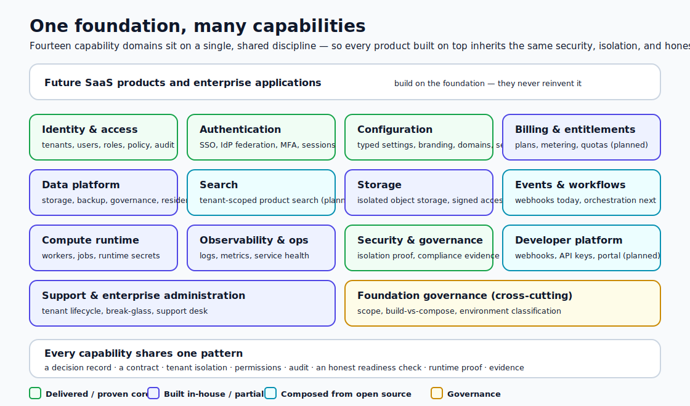
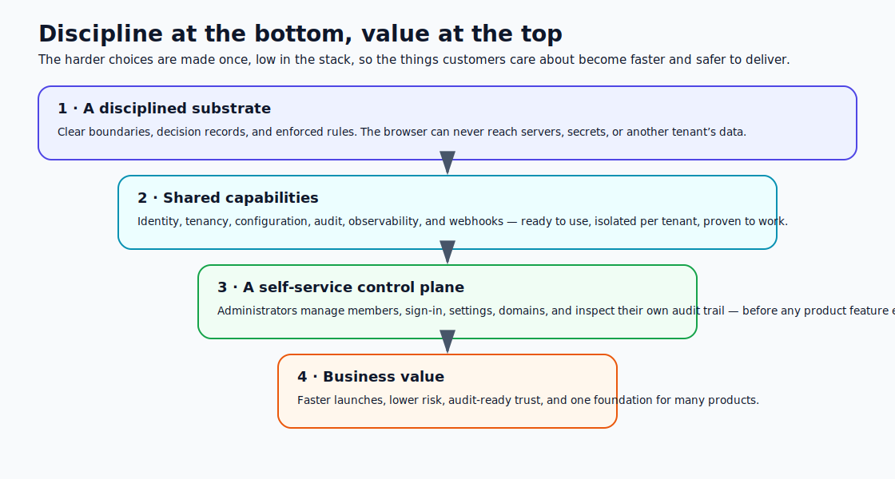
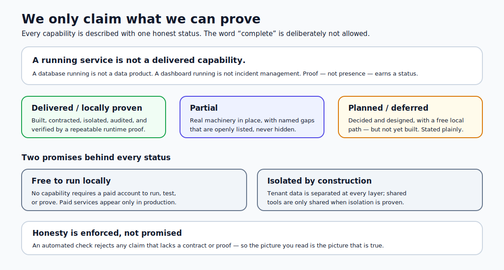

# Universal Service Foundation

> **One foundation that many software products can be built on — secure, isolated, and honest by design, with every capability proven before it is claimed.**

Most software platforms are built product-first. The plumbing every product secretly needs — sign-in, customer separation, settings, audit, billing, search, notifications — gets bolted on later, differently each time, and rarely with the rigour it deserves. The result is duplicated effort, inconsistent security, and trust that is hard to demonstrate.

The **Universal Service Foundation** takes the opposite approach. It treats those shared needs as a single, deliberate **foundation**: a set of composable capabilities that any future product can stand on. Each capability is decided once, built to the same high standard, isolated per customer, and verified with real evidence — so products built on top inherit safety and trust for free, instead of rebuilding it.

This is not a single application. It is the dependable ground floor that many applications can share.

---

## Why a foundation, not a feature set

A capability only counts as part of the foundation when it is delivered to the same standard as everything else — a clear decision behind it, a stable contract, customer-by-customer isolation, permission controls, an audit trail, an honest readiness check, a repeatable proof, and a self-service surface where it makes sense.

That bar is intentionally high. It means:

- **Security is structural, not optional.** Unsafe shortcuts are designed out, not policed after the fact.
- **Every product starts further ahead.** The hard, shared problems are already solved and proven.
- **Trust is demonstrable.** What the platform claims, it can prove — to customers, auditors, and the team.

---

## The capability domains

The foundation is organised into fourteen capability domains. Some are delivered and proven today; others are decided and designed, ready to be built on the same pattern.

| Domain                             | What it provides                                                                         | Status today                                               |
| ---------------------------------- | ---------------------------------------------------------------------------------------- | ---------------------------------------------------------- |
| **Identity &amp; access**          | Customers (tenants), users, roles, fine-grained permissions, and privileged-access audit | Delivered for the core; richer self-service planned        |
| **Authentication**                 | Secure sign-in, single sign-on, external identity providers, and multi-factor policy     | Delivered; some enterprise sign-in proofs planned          |
| **Configuration**                  | Typed per-customer settings, branding, custom domains, and write-only secrets            | Delivered; richer branding planned                         |
| **Billing &amp; entitlements**     | Plans, pricing, usage metering, quotas, and subscriptions                                | Planned                                                    |
| **Data platform**                  | Reliable storage, backups, data governance, and residency controls                       | Core delivered; governance and recovery planned            |
| **Search**                         | Fast, customer-scoped, permission-aware product search                                   | Planned                                                    |
| **Storage**                        | Isolated file storage with safe, signed access                                           | Foundations delivered; full storage product planned        |
| **Events &amp; workflows**         | Reliable event delivery, queues, and long-running orchestration                          | Webhooks delivered; workflow engine planned                |
| **Compute runtime**                | Background workers, scheduled jobs, and runtime secrets                                  | Partial; broader job runner planned                        |
| **Observability &amp; operations** | Structured logs, metrics, and honest service health                                      | Logs delivered; alerting and incidents planned             |
| **Security &amp; governance**      | Provable customer isolation, compliance evidence, and reviews                            | Isolation proven; compliance reporting planned             |
| **Developer platform**             | Webhooks, API keys, developer portal, and documentation                                  | Webhooks delivered; portal and keys planned                |
| **Support &amp; administration**   | Customer lifecycle, safe operator access, and support tooling                            | Provisioning delivered; lifecycle and support desk planned |
| **Foundation governance**          | The rules that keep every capability honest and consistent                               | Delivered                                                  |

> [!NOTE]
> "Planned" means **decided and designed with a free way to build and prove it locally** — not vague intent. The foundation never counts an idea, or a running service, as a finished capability.

---

## At a glance: what is and isn't delivered

To avoid any impression that the whole foundation already exists, here is the honest split. The authoritative, capability-by-capability record lives in the [Universal Service Foundation matrix](docs/evidence/platform/universal-service-foundation-matrix.md); the build order is in the [implementation roadmap](docs/evidence/platform/universal-service-foundation-implementation-roadmap.md).

**Delivered now** — built to the full standard and in use:

- User identity, roles and permissions, and a privileged-access audit trail
- External sign-in (OIDC) federation, write-only secret settings, typed per-customer configuration
- Outbound webhooks with signing, delivery, and retry

**Locally proven** — built and demonstrated with a repeatable proof against the local stack:

- Customer (tenant) identity and isolation, sign-in and sessions, relational storage with per-customer separation
- Structured logs, an honest service-readiness map, custom-domain routing, and local backup/restore

**Phase 1 substrate (delivered, locally proven)** — built behind the BFF with deny-by-default, audit-before-change, and no tenant self-grant; proven against the local database (real row-level-security isolation) and the real API routes, plus node and UI tests:

- **Entitlements** — what each customer is allowed to use, assigned by operators (who pick a customer from a lookup, not a raw id), with a read-only customer view and a service catalog of backing providers.
- **Usage metering & quotas** — recorded per-customer usage (isolated and idempotent) and **real quota enforcement**: when a customer exceeds a configured limit, the next action is denied server-side (entitlement is checked before quota). Operators set limits; customers see their own usage read-only. _Billing/charging is not part of this — that is a later phase._

**Planned foundation capabilities** — decided, designed, and buildable locally for free, but **not yet built**:

- Usage metering, real quotas, plans/billing (payment capture aside, below)
- Product search, an event bus and workflow engine, multi-channel notifications and user preferences
- End-user profile self-service, API keys and a developer portal, metrics/traces and alerting/incident management
- Data governance and DSR, point-in-time recovery and retention, customer suspend/delete/export, the full storage and support products

**Explicitly not yet delivered** — gaps and deliberate exclusions, stated openly:

- **Payment capture** is the one capability that needs a real paid provider; it is isolated behind an adapter and is **never** part of local proof
- **Real external-IdP sign-in** is proven only against a local fixture; verification against a real provider is **blocked** until one is available, and **SAML** is not yet supported
- A **central secrets manager** is planned; today secrets use encrypted database/environment storage
- **Serverless function hosting** is **deferred** until a concrete product need is proven

---

## What is delivered and proven today

The foundation already runs a complete, isolated control plane that customers and operators use — long before any product feature sits on top.

### A self-service control plane

Each customer organisation has a real administration cockpit, not a placeholder settings page. Administrators can:

- **Manage their people** — invite, assign roles, enable or disable members, and see external sign-in links.
- **Control how their people sign in** — choose sign-in providers, connect their own identity provider, and set session and multi-factor policy.
- **Govern their settings** — adjust typed configuration and feature options, with safe defaults and one-click reset.
- **Own their email and domains** — set a sender identity and verify a custom web address.
- **See their storage and signals** — confirm isolated storage and the health of the services behind their workspace.
- **Subscribe to events** — receive reliable, signed webhooks with automatic retry and recovery.
- **Inspect their own history** — read a tenant-scoped audit trail showing who changed what, and when.
- **Read an honest readiness map** — see, capability by capability, exactly what is ready and what still needs setup.

### Trust built in

- **Customers are separated at every layer.** Data, identity, sessions, files, and web addresses are isolated per customer — separation is the default, not a switch that can be forgotten.
- **Sign-in is handled safely.** Login secrets never reach the browser; sessions are encrypted and protected.
- **Every change is recorded before it happens.** Sensitive actions write an audit record first; if the record can’t be written, the action doesn’t proceed.
- **Sensitive secrets are write-only.** Credentials can be set but never read back, and are never shown in logs or history.

### Accessible and polished

The interface targets **WCAG 2.2 Level AA** from the start — keyboard navigation, clear labels, visible focus, and assistive-technology support are built in rather than retrofitted. Branding adapts per customer.

---

## Honesty you can rely on

The hardest discipline in a platform like this is telling the truth about what works. The Universal Service Foundation treats honest status as a first-class feature.

- **A running service is never counted as a delivered capability.** Presence is not proof.
- **Every capability carries one honest status** — delivered, proven, partial, planned, or deferred — and gaps are listed openly.
- **The word “complete” is deliberately not allowed**, because it invites overstatement.
- **An automated check rejects any claim** that lacks a real contract or a repeatable proof — so the published picture stays true over time.

This means leaders, customers, and auditors can trust the roadmap and the status, not just the marketing.

### The proof ladder

Each proven capability is backed by a repeatable, runnable proof — a single source of truth registered in `@platform/contracts-admin` and reconciled against the `proof:*` scripts and this README by an automated gate. The current ladder:

- **Authentication and identity** — `proof:auth-settings`, `proof:auth-idps`, `proof:auth-credential-lifecycle`, `proof:auth-oidc-enterprise`
- **Domains and host identity** — `proof:tenant-domains`, `proof:tenant-domains-routing`, `proof:tenant-domain-canonical`, `proof:tenant-domain-claim-lifecycle`, `proof:tenant-custom-domain-resolution`, `proof:tenant-custom-domain-auth-origin`, `proof:domain-identity-matrix`
- **Tenant services** — `proof:email-sender`, `proof:tenant-storage`, `proof:tenant-observability`
- **Events and webhooks** — `proof:webhooks`, `proof:webhook-worker`, `proof:webhook-redrive`
- **Operations** — `proof:platform-services`, `proof:service-clickthrough-policy`, `proof:backup-local`
- **Entitlements and service catalog (Phase 1)** — `proof:entitlements`, `proof:entitlement-policy-chain`, `proof:service-catalog-registry`, `proof:entitlements-postgres`, `proof:entitlements-routes`
- **Metering and quota enforcement (Phase 2)** — `proof:metering`, `proof:quota-enforcement`, `proof:metering-quota-routes`
- **Developer platform — API keys + rate limits (Phase 3)** — `proof:api-keys`, `proof:rate-limits`, `proof:api-key-routes`
- **Rate-limit provider — Redis counter behind the port (Phase 3.5)** — `proof:rate-limits-redis`
- **Tenant-isolated product search (Phase 4)** — `proof:search`, `proof:search-isolation`, `proof:search-routes`
- **Event bus + durable workers (Phase 5)** — `proof:event-bus`, `proof:event-worker`, `proof:event-redrive`
- **Profile + notifications (Phase 6)** — `proof:profile-self-service`, `proof:notification-preferences`, `proof:notification-dispatch`
- **Observability — alerting + incidents (Phase 7)** — `proof:observability-signals`, `proof:alerting`, `proof:incident-foundation`, `proof:alert-notification-bridge`
- **Scheduled jobs on the event substrate (Phase 5.5)** — `proof:scheduled-jobs`, `proof:scheduled-job-routes`

---

## Built to stay free and local

A foundation is only useful if the whole team can run it, and only trustworthy if every capability can be proven without hidden dependencies.

- **Free to run locally.** No capability requires a paid account to develop, test, or demonstrate. Paid services appear only as production options, behind a clean boundary.
- **Open-source where it makes sense.** Mature, commodity needs are met with well-chosen open-source components rather than reinvented — and only when they can isolate each customer cleanly.
- **Built in-house where it matters.** Thin, security-sensitive capabilities are built directly into the foundation so they stay under tight control.
- **A deliberate decision every time.** Each capability is consciously chosen to be built, composed, integrated, deferred, or rejected — never added on a whim.

---

## The benefits

<!-- markdownlint-disable MD028 -->

> [!TIP]
> **Faster product delivery.** New products begin with identity, tenancy, settings, audit, and observability already solved and proven. Teams build features, not foundations.

> [!TIP]
> **Lower risk by design.** Customer isolation, safe sign-in, and audit-before-change are structural guarantees — not habits that erode under deadline pressure.

> [!TIP]
> **Trust you can demonstrate.** Honest status, recorded decisions, and verifiable evidence make it straightforward to satisfy customers, auditors, and security reviews.

> [!TIP]
> **One foundation, many products.** The same dependable ground floor supports many applications, so investment compounds instead of being rebuilt each time.

> [!TIP]
> **No nasty surprises.** Because the platform refuses to overstate readiness, what you see is what you get — in development, in demos, and in production.

> [!TIP]
> **Accessible and inclusive.** Meeting recognised accessibility standards from day one widens reach and reduces costly remediation later.

<!-- markdownlint-enable MD028 -->

---

## How it grows

The foundation expands in a deliberate order, driven by what each capability depends on rather than what looks impressive:

1. **Lock the scope and principles**, so growth stays honest and isolated.
2. **Generalise the shared services**, so every new capability plugs in the same way.
3. **Add entitlements and access policy**, the gatekeepers for paid and restricted features.
4. **Introduce metering and billing**, with the single unavoidable paid step kept safely isolated.
5. **Grow events into workflows and notifications**, building on the proven delivery engine.
6. **Add search, analytics, alerting, governance, and a developer portal** as the needs they serve become real.

Each step lands only when it is built, isolated, audited, proven, and documented — never before.

---

## In short

The Universal Service Foundation turns the shared, invisible plumbing of modern software into a deliberate, trustworthy, reusable asset. It is secure because insecure paths are designed out. It is multi-tenant because separation is the default. It is honest because it proves what it claims and refuses to overstate. And it is built to be shared, so that many products can stand on one dependable foundation instead of each rebuilding the ground beneath them.

The result is not just another application. It is the ground floor worth building on.

---

## License

MIT
