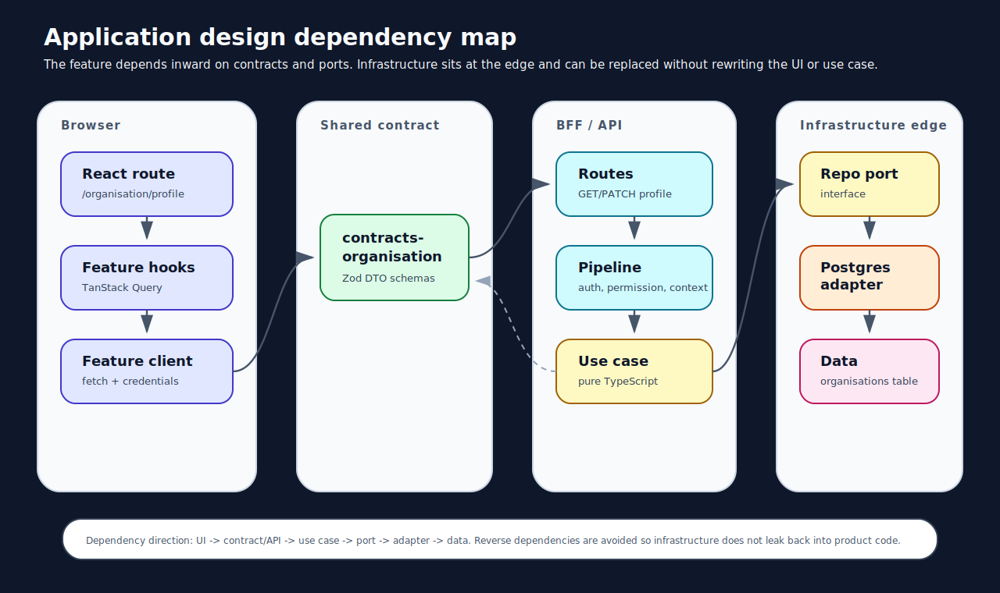
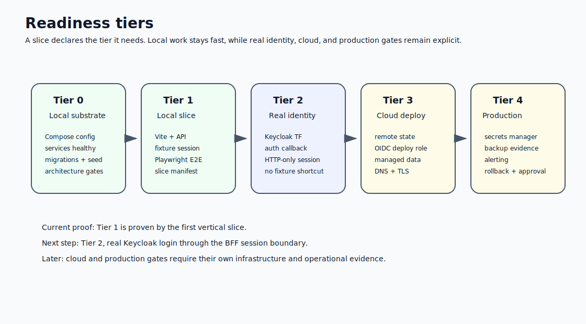

# Enterprise React Platform


> **A production-grade multi-tenant SaaS foundation — governed, tested, and secure from the first commit.**

Most React projects start at the screen. Structure is retrofitted once the product has hardened around shortcuts. The cost of that retrofit is high: security vulnerabilities that cannot be removed without rebuilding, test suites that mock away the bugs, component trees that own things they were never supposed to own.

This repository takes the opposite path. Architecture decisions come first. Every structural choice is written as an ADR, enforced by tooling, and tested before a feature is built on top of it.

---

## What is built

| Layer              | Technology                                              | Role                                                             |
| ------------------ | ------------------------------------------------------- | ---------------------------------------------------------------- |
| **React SPA**      | React 19, TanStack Router, React Query, React Aria      | Typed routes, server-state cache, accessible primitives          |
| **BFF / API**      | Node.js, TypeScript, Fastify-style pipeline             | Session resolution, permission enforcement, domain orchestration |
| **Identity**       | Keycloak (per-tenant realms), PKCE + OIDC               | SSO, multi-realm tenant isolation, UMA authorisation             |
| **Database**       | PostgreSQL (schema-per-tenant + RLS), Redis, ClickHouse | Transactional data, sessions, analytics                          |
| **Storage**        | MinIO / S3-compatible                                   | Object storage with per-tenant prefix isolation                  |
| **Email**          | Brevo / SMTP, Mailpit locally                           | Transactional email with inbox preview                           |
| **Observability**  | OpenTelemetry, Loki, Grafana, Alloy, Sentry             | Structured logs, distributed traces, error monitoring            |
| **Infrastructure** | Caddy, Docker Compose, Terraform, AWS, Cloudflare       | Reverse proxy, local dev, declarative cloud provisioning         |
| **Quality**        | Playwright, Vitest, ESLint, SonarQube, gitleaks         | E2E, unit, static analysis, secret scanning                      |

---

## Architecture

### Hexagonal, import-enforced, dependency-injected

```text
Browser → React SPA → BFF Pipeline → Use Cases → Repository Ports → Adapters → External Systems
```

Import rules are **machine-enforced** by `validate-source-imports`. Violations are build-time failures — not PR comments.

| Package group               | Can import                                    | Cannot import                                        |
| --------------------------- | --------------------------------------------- | ---------------------------------------------------- |
| `domain-*`                  | `observability`, `platform-errors`            | Pino, OTel SDK, Keycloak SDK, Postgres, Redis, React |
| `feature-*`                 | Domain, contracts, runtime context            | Adapters, infrastructure, BFF internals              |
| `adapters-*`                | Platform runtimes, domain ports               | Other adapters, React, BFF routes                    |
| `ui-design-system`          | React Aria, Tailwind                          | Backend packages, adapters, domain logic             |
| `apps/react-enterprise-app` | Feature hooks, contracts, i18n, design system | `pino`, `pg`, `ioredis`, Keycloak SDK                |

> [!IMPORTANT]
> The React app is browser-only. It cannot import database clients, migrations, Redis sessions, Keycloak SDKs, or token exchange logic. The BFF owns all of that. This boundary is enforced at the compiler level — not by convention.



### 49 governed packages

Every package carries machine-validated metadata: lifecycle class (`stable` / `active` / `experimental`), bounded context, package name, description, and dependency constraints. Lifecycle transitions require evidence bundles.

<details>
<summary>Full package inventory</summary>

| Package                    | Role                                                  |
| -------------------------- | ----------------------------------------------------- |
| `domain-core`              | Pure domain primitives — zero framework dependencies  |
| `domain-identity`          | User, Organisation, Membership, ExternalIdentity      |
| `contracts-organisation`   | Zod schemas — organisation request/response contracts |
| `contracts-auth`           | Auth session types, actor model, permission types     |
| `contracts-graphql`        | GraphQL type definitions shared across boundary       |
| `contracts-analytics`      | Analytics event schemas                               |
| `contracts-ingestion`      | Data ingestion contracts                              |
| `adapters-keycloak`        | Keycloak realm admin + provisioning adapter           |
| `adapters-postgres`        | SQL repositories, RLS, connection pooling             |
| `adapters-redis`           | Session store, PKCE state                             |
| `adapters-opentelemetry`   | OTel trace/span adapter                               |
| `adapters-sentry`          | Error capture adapter (opt-in)                        |
| `adapters-graphql`         | GraphQL schema builder and executor                   |
| `adapters-brevo`           | Transactional email adapter                           |
| `adapters-clickhouse`      | Analytics ingestion adapter                           |
| `adapters-object-storage`  | S3-compatible storage adapter                         |
| `adapters-ingestion`       | Data ingestion pipeline adapter                       |
| `platform-logging`         | Pino-backed structured logger + browser logger        |
| `platform-errors`          | Typed error hierarchy — no raw `Error` throws         |
| `platform-observability`   | OTel span port (domain-safe wrapper)                  |
| `platform-runtime-context` | Request-scoped context propagation                    |
| `observability`            | `ObservabilityPort` interface — zero dependencies     |
| `session-runtime`          | Session store abstraction                             |
| `audit-events`             | Typed audit event definitions and port                |
| `authorisation-runtime`    | Permission model, UMA types, resource policies        |
| `i18n-runtime`             | `I18nProvider`, `useTranslation`, locale loading      |
| `ui-design-system`         | React Aria + Tailwind component library               |
| `api-runtime`              | BFF request/response pipeline helpers                 |
| `graphql-api-runtime`      | Schema execution, resolver types, context             |
| `worker-runtime`           | Background job abstractions                           |
| `config-runtime`           | Environment configuration helpers                     |
| `email-runtime`            | Email template and dispatch abstractions              |
| `notification-runtime`     | Notification port and dispatch                        |
| `queue-runtime`            | Queue producer/consumer abstractions                  |
| `search-runtime`           | Search index port                                     |
| `storage-runtime`          | Object storage port                                   |
| `access-control`           | RBAC permission table and resolution                  |
| `security-auth`            | Auth security helpers                                 |
| `profile-configuration`    | Per-org and per-user profile config                   |
| `feature-workflow`         | Feature flag / workflow orchestration                 |
| `infra-aws`                | AWS CDK/Terraform constructs                          |
| `infra-cloudflare`         | Cloudflare Workers and DNS Terraform                  |
| `tooling-ci`               | CI pipeline helpers                                   |
| `tooling-codegen`          | Code generation utilities                             |
| `tooling-docker`           | Docker build helpers                                  |
| `tooling-terraform`        | Terraform workflow utilities                          |
| `test-support`             | Shared test fixtures and substrate helpers            |
| `dev-services`             | Local development service utilities                   |

</details>

---

## React capabilities

### TanStack Router — fully typed routing

Route parameters, search parameters, and loader data are typed end-to-end. No string casting, no runtime surprises.

```typescript
export const Route = createRoute({
  getParentRoute: () => rootRoute,
  path: "/organisation/$slug/members",
  component: MembersPage,
});

const { slug } = Route.useParams(); // string — TypeScript enforced, no casting
```

The router is configured with `defaultErrorComponent`, `defaultPendingComponent`, and `defaultNotFoundComponent` — every route handles errors, loading, and 404 gracefully without per-route boilerplate.

### TanStack Query — server state done right

Server data lives in the query cache. Stale-time, background refetch, cache invalidation, and optimistic updates work at the hook layer.

```typescript
const { data: profile, error } = useOrganisationProfile(); // typed, cache-backed
const mutation = useUpdateOrganisationProfile(); // invalidates cache on success
// error is surfaced — a 500 shows ErrorState, not a silent redirect to /login
```

### React Hook Form + Zod — contract-driven forms

Forms validate against the **same Zod schema** used by the API. The contract is the single source of truth from the database column to the `<input>` element.

```typescript
const {
  register,
  handleSubmit,
  formState: { errors },
} = useForm<UpdateOrganisationProfileRequest>({
  resolver: zodResolver(UpdateOrganisationProfileRequestSchema),
  values: profile ? { displayName: profile.displayName } : undefined,
});
```

### React Aria Components — accessible by construction

Interactive components are built on `react-aria-components`. Keyboard navigation, ARIA state management, pressed/selected/focused state, and focus containment are correct by construction — not retrofitted after an audit.

### i18n — no hardcoded strings

All user-visible strings go through `@platform/i18n-runtime`. The `I18nProvider` and `useTranslation()` hook are wired at the application root. Adding a locale is a JSON file — no component changes needed.

```typescript
const t = useTranslation();
return <button>{t("ui.action.save")}</button>;
```

The architecture validator enforces that every `t()` key exists in `en-GB.json` — missing translations are a build failure.

### WCAG 2.2 Level AA

> [!NOTE]
> The shell is audited to WCAG 2.2 Level AA before the first product feature is built. Accessibility is foundational, not retrofitted.

- Skip navigation link as the first focusable element on every route
- `lang="en-GB" dir="ltr"` on the HTML element
- Form fields: `aria-describedby`, `aria-invalid`, `id`-linked error messages with `role="alert"`
- Always-mounted `role="status"` / `role="alert"` live regions for async feedback
- Colour contrast ≥ 4.5:1 for all text (verified against Tailwind `gray-600` minimum)
- Focus-visible rings on all interactive elements, including Windows High Contrast mode (`forced-colors` CSS media query)
- `autoComplete` attributes on identity-adjacent inputs
- Semantic `<main id="main-content">` landmark on every route
- Document `<title>` updated per route

---

## UI development is now open

The pre-UI platform baseline is hardened (ADR-ACT-0203). New screens are built from one
canonical pattern — see **`docs/patterns/ui-feature-template.md`** — so they conform
automatically to ADRs, architecture boundaries, accessibility, theming, the generated
GraphQL contract flow, MSW testing, and the route/layout conventions.

What is in place:

- **Generated GraphQL contracts.** Operations are authored as `.graphql` documents in
  `@platform/contracts-graphql`; `npm run codegen` emits browser-safe `TypedDocumentNode`
  artifacts. Features pass them to `@platform/graphql-browser-client` (the only module that
  prints a document) — no inline GraphQL, no `graphql/*` in the SPA. Drift is gated by
  `npm run codegen:check`.
- **Authenticated layout.** The `_authenticated` pathless route owns the auth gate and the
  single `<main id="main-content">` via AppShell; per-route `RequirePermission`.
- **MSW substrate.** Personas + GraphQL factories + theme/session handlers in `src/msw`;
  feature tests never hand-roll fetch mocks.
- **Theme tokens.** Semantic CSS-variable tokens drive colour; the tenant theme
  (`/api/theme`) overrides `--color-primary` at bootstrap.
- **Reference implementation.** The organisation profile feature
  (`src/features/organisation/`) is the live example.

Scaffold a feature:

```bash
npm run generate:feature -- --name=<name> --type=form-edit|read-only-detail|table-search|admin-settings
```

Gates for UI work:

```bash
npm run codegen:check
npm run tsc:check
npm run test:frontend:run
npm run test:platform-api
npm run test:architecture
npm run validate:slices
make check
```

---

## Authentication

### Zero tokens in the browser

The login flow is a proper **Authorization Code + PKCE** exchange through the BFF. Raw tokens never reach the browser.

```text
Browser   →  GET /auth/login       BFF generates PKCE challenge, stores state in Redis (one-use)
BFF       →  302 to Keycloak       Keycloak renders login UI
Keycloak  →  302 /auth/callback    BFF exchanges code for tokens
BFF       →  createSession()       tokens encrypted AES-256-GCM, stored in Redis
BFF       →  Set-Cookie: session   HttpOnly · SameSite=Lax · Secure
Browser   →  GET /api/session      receives safe actor object — no tokens ever exposed
```

```typescript
// All the React app ever receives:
const { actor, isAuthenticated, hasPermission } = useSession();
// actor: { userId, displayName, email, organisationId, roles, permissions }
```

### Session security

| Protection       | Implementation                                                                             |
| ---------------- | ------------------------------------------------------------------------------------------ |
| Token encryption | AES-256-GCM, random 12-byte IV, GCM auth tag; startup throws in production if key absent   |
| Cookie flags     | `HttpOnly`, `SameSite=Lax`, `Secure` (env-controlled)                                      |
| Logout           | Dual-cookie clear (host-only + domain-scoped); RP-Initiated Logout to Keycloak end-session |
| Redirect safety  | `safeRelativeRedirect()` — absolute URLs in `returnTo` are rejected                        |
| PKCE             | 32-byte random verifier, S256 challenge, one-use Redis state, nonce bound to user-agent    |
| Forward-auth     | `CADDY_INTERNAL_SECRET` required in staging/production; startup throws if absent           |

---

## Multi-tenancy

Tenant isolation is structural, not a flag. Every layer isolates independently.

| Layer          | Isolation mechanism                                                                                                                                                                         |
| -------------- | ------------------------------------------------------------------------------------------------------------------------------------------------------------------------------------------- |
| **PostgreSQL** | Schema-per-tenant + Row-Level Security. Runtime pool connects as `platform_app` (`NOSUPERUSER`, `NOBYPASSRLS`). RLS enforced at the database engine — no application-layer bypass possible. |
| **Keycloak**   | Per-tenant realm. Each tenant controls its own users, IdP federation, MFA policy, session lifetime, and BFF client secrets independently.                                                   |
| **Routing**    | `aldous.info` → super-global admin. `{slug}.aldous.info` → tenant app. BFF resolves tenant from FQDN on every request.                                                                      |
| **Redis**      | Per-tenant session namespace prefix.                                                                                                                                                        |
| **S3 / MinIO** | Per-tenant object prefix with bucket policy enforcement.                                                                                                                                    |

### Tenant provisioning — atomic and idempotent

`POST /api/admin/tenants` orchestrates all layers with rollback on failure:

```text
1. PostgreSQL  → create schema, run RLS migrations
2. Keycloak    → create realm, BFF client, PKCE config, mappers, auth server
3. UMA         → register resources: organisation:profile, members, admin:auth, platform:support
4. Redis       → create session namespace
5. S3          → create object prefix
   ↳ Any step fails → rollback all completed steps automatically
```

### FQDN routing via Caddy

```text
aldous.info            → super-global admin (system_admin role required)
{slug}.aldous.info     → tenant React app + BFF
aldous.info/kc         → Keycloak (all realms)
aldous.info/grafana    → Grafana (observability-gated)
aldous.info/sentry     → Sentry (profile-gated)
aldous.info/mailpit    → Mailpit (admin-gated)
aldous.info/minio      → MinIO console (admin-gated)
aldous.info/sonar      → SonarQube (admin-gated)
aldous.info/wiremock   → WireMock admin (dev-only, not exposed via Caddy in production)
```

All admin tool routes go through Caddy forward-auth — the BFF validates the session and role before proxying.

---

## Authorisation

### UMA with static backstop

Every protected API route declares a resource and UMA scope. The BFF evaluates a Keycloak UMA ticket at runtime — policy is configurable without deployment.

```typescript
// Route declaration
{ path: "/api/organisation/members", method: "GET",
  resource: "organisation:members", umaScope: "read",
  requiredPermission: "organisation.members:read" } // static backstop if Keycloak unreachable
```

Degraded mode: if Keycloak is unreachable, the pipeline falls back to static `hasPermission()` checks. Routes with `resource`+`umaScope` but no `requiredPermission` fail closed.

### Support mode

System administrators can enter a tenant context with a full audit trail:

- Reason required (non-empty)
- Audit event persisted to Postgres **before** session creation
- Separate `supportSessionId` distinct from the actor's own session
- `canAccessTenantFqdn()` enforces the target organisation boundary throughout the request lifecycle

---

## Audit trail

Every state-changing operation emits a persistent audit event **before** the mutation executes. Audit failure aborts the operation — the external system is never modified without a record.

```typescript
await deps.audit.emit(createAuditEvent({ actorId, tenantId, action, resource, metadata }));
// Postgres INSERT — if this throws, execution stops here

await deps.adapter.setResourcePolicy(name, policy);
// Keycloak mutation — only reached if audit succeeded
```

> [!IMPORTANT]
> This ordering is tested explicitly. Unit tests assert that `audit.emit` is called before `adapter.setResourcePolicy`, and that when `audit.emit` throws, the adapter is never called. This guarantee is not maintained by convention — it is verified on every run.

Audited operations: IdP configuration, MFA policy, session settings, sysadmin-brokering, resource policies, vanity domains, member invitations and removals, sub-organisation management, support-mode entry.

---

## Observability

```text
platform-api (Pino JSON stdout)
  └─→ Grafana Alloy  (container discovery, JSON parse, label extraction)
        └─→ Loki  (30-day retention, TSDB v13)
              └─→ Grafana  (pre-provisioned dashboard)

OpenTelemetry Collector  (OTLP gRPC on :4317, HTTP on :4318)

Sentry  (adapter-wired, opt-in via SENTRY_ENABLED=true)
```

Every request log line carries: `requestId`, `traceId`, `spanId`, `actorId`, `tenantId`, `organisationId`, `method`, `path`, `durationMs`, `statusCode`.

Grafana dashboard auto-provisioned at startup: error/warning rates, slow requests, top failing routes, per-tenant breakdown panels.

Per-environment OTel collector ports: dev `:4317`, test `:4322`, staging `:4327`, prod `:4332` — no cross-environment telemetry bleed.

---

## Testing

### Coverage by layer

| Suite            | Command                     | What it covers                                                                                                       |
| ---------------- | --------------------------- | -------------------------------------------------------------------------------------------------------------------- |
| **Architecture** | `npm run test:architecture` | Import boundaries, package metadata, lifecycle evidence, i18n key coverage, port composition, Compose port conflicts |
| **Platform API** | `npm run test:platform-api` | Use cases, domain logic, auth pipeline, PKCE, session cookies, RLS, audit ordering — against real Postgres + Redis   |
| **Frontend**     | `npm run test:frontend:run` | Vitest + RTL — hooks, components, MSW-backed service layer, i18n provider                                            |
| **E2E dev**      | `make e2e-dev`              | Playwright — full browser, real TanStack Router, fixture session                                                     |
| **E2E prod**     | `make e2e-prod`             | Playwright — real Keycloak, live `aldous.info`, all external routes                                                  |
| **Compose**      | `npm run test:compose`      | All 7 Compose profiles validate without port conflicts                                                               |

> 255 tests passing · 0 failures

### Critical ordering tests

Audit-before-mutation ordering is verified explicitly with mock call-order assertions:

- `setResourcePolicy` — audit fires before Keycloak adapter
- `addVanityDomain` — audit fires before fetch
- `removeVanityDomain` — invalid domain aborts before audit
- `enterSupportMode` — audit fires before session creation; audit failure prevents session

### Production test groups

The prod stage runs all 10 test groups: `unit · contract · port · interface · integration · tenant · compose-smoke · external-smoke · auth-e2e · production-e2e`

---

## Four isolated environments

`make all` promotes code through four fully isolated environments in sequence.

```text
preflight
  └─→ dev   (port 3001, volatile data, all test groups)
        └─→ test     (port 3002, volatile data, all test groups)
              └─→ staging  (port 3003, seeded data, all test groups)
                    └─→ prod     (port 3004, seeded data, smoke only)
                          └─→ evidence written to docs/evidence/stages/
```

Each stage has its own Compose project, credentials, data policy, and OTel port allocation. Failure at any stage stops promotion. Every passing run commits signed evidence JSON — every deploy has a verifiable record.



<details>
<summary>Stage policy configuration</summary>

Defined in `env/stage-policy.yaml`:

```yaml
stages:
  dev:
    executor: local
    dataPolicy: volatile
    authMode: full-auth
    testGroups: all
  test:
    executor: local
    dataPolicy: volatile
    authMode: full-auth
    testGroups: all
  staging:
    executor: local
    dataPolicy: seeded
    authMode: full-auth
    testGroups: all
  prod:
    executor: local
    dataPolicy: seeded
    authMode: full-auth
    testGroups: smoke-only
```

</details>

---

## Security posture

| Surface                  | Control                                                                                                          |
| ------------------------ | ---------------------------------------------------------------------------------------------------------------- |
| **Token storage**        | AES-256-GCM in Redis; `assertEncryptionKeyConfigured()` throws at startup in production if key absent            |
| **Cookies**              | `HttpOnly`, `SameSite=Lax`, `Secure`; dual-clear on logout (host-only + domain-scoped)                           |
| **Open redirects**       | `safeRelativeRedirect()` — absolute URLs in `returnTo` rejected at the function level                            |
| **CSP**                  | `default-src 'self'` + `base-uri 'none'` + `form-action 'self'` + `object-src 'none'` + `frame-ancestors 'none'` |
| **SQL injection**        | Parameterised queries throughout; schema identifiers via `client.escapeIdentifier`                               |
| **RLS**                  | `platform_app` role (`NOSUPERUSER`, `NOBYPASSRLS`); no superuser connection in runtime paths                     |
| **Keycloak credentials** | No hardcoded secrets; provisioner uses `client_credentials` grant exclusively                                    |
| **Forward-auth**         | `CADDY_INTERNAL_SECRET` required in staging/production; startup throws if absent                                 |
| **Audit**                | Persistent Postgres record before every mutation; audit failure aborts execution                                 |
| **Secret scanning**      | gitleaks pre-commit hook · OSV scanner · `npm audit` · CodeQL · SonarQube                                        |

---

## Governance

### 35 ADRs, all accepted

Every structural decision is an ADR. Every ADR is a constraint enforced by the architecture orchestrator.

<details>
<summary>ADR index</summary>

| ADR  | Decision                                                                      |
| ---- | ----------------------------------------------------------------------------- |
| 0001 | Use modular hexagonal architecture                                            |
| 0002 | Model the platform around bounded contexts                                    |
| 0003 | Use a modular monorepo with promotion-ready package boundaries                |
| 0004 | Define package lifecycle classes                                              |
| 0005 | Define package metadata vocabulary and format                                 |
| 0006 | Define package lifecycle transition rules                                     |
| 0007 | Define architecture artifact and repository directory layout                  |
| 0008 | Define generated package README structure                                     |
| 0009 | Define package inventory and report structure                                 |
| 0010 | Define lifecycle transition evidence bundle format                            |
| 0011 | Define architecture tooling execution model                                   |
| 0012 | Define architecture tooling test, validation, TUI, and self-evidence strategy |
| 0013 | Define client-facing API boundary (GraphQL primary)                           |
| 0014 | Define transactional data ownership                                           |
| 0015 | Define analytical data ownership                                              |
| 0016 | Define enterprise quality gate and security baseline                          |
| 0017 | Define local integration service substrate                                    |
| 0019 | Define React component platform and frontend integration stack                |
| 0020 | Define observability, diagnostics, and runtime introspection primitives       |
| 0021 | Define identity, tenancy, roles, and permissions model                        |
| 0022 | Define authentication, session, and SSO integration boundary                  |
| 0023 | Define declarative infrastructure provisioning model                          |
| 0024 | Define slice readiness and dependency gate model                              |
| 0025 | Define Playwright end-to-end testing strategy                                 |
| 0026 | Define internationalisation and translation resource model                    |
| 0027 | Define Tilt local development feedback loop                                   |
| 0028 | Define GraphQL schema boundary governance                                     |
| 0029 | Define multi-tenant isolation boundaries                                      |
| 0030 | Define dynamic authorisation and tenant admin self-service                    |
| 0031 | Define infrastructure provisioning privilege model                            |
| 0032 | E2E testing strategy                                                          |
| 0033 | Define environment-specific domain and hostname configuration                 |
| 0034 | Define per-environment test composition                                       |
| 0035 | Enterprise log indexing and search                                            |

</details>

### Architecture orchestrator — 10 gates on every commit

```bash
node tools/architecture/orchestrator/src/index.mjs all --strict

✓ validate-package-metadata      all 49 packages have valid lifecycle metadata
✓ validate-source-imports         0 import boundary violations
✓ generate-package-readmes        READMEs match source-of-truth metadata
✓ generate-package-inventory      package graph snapshot current
✓ validate-lifecycle-evidence     all promotions have evidence bundles
✓ validate-slice-readiness        slice dependencies satisfied
✓ validate-i18n                   all t() keys exist in en-GB.json
✓ validate-pipeline-composition   BFF route port composition valid
✓ validate-compose-ports          no port conflicts across all 7 profiles
✓ (lefthook pre-commit)           format + lint + typecheck run before every commit
```

---

## Local development

### Start the platform

```bash
npm ci
make compose-up-default          # Postgres, Redis, ClickHouse, MinIO, Mailpit, OTel
make compose-up-identity         # + Keycloak (SSO, per-tenant realms)
make compose-up-web              # + Caddy (full FQDN routing on aldous.info)
tilt up                          # hot-reload dev loop — http://localhost:10350
```

### Local URLs

| Service      | Direct                           | Via Caddy                    |
| ------------ | -------------------------------- | ---------------------------- |
| React app    | `http://localhost:5173`          | `http://aldous.info`         |
| Platform API | `http://localhost:3001`          | `http://aldous.info/api`     |
| Keycloak     | `http://localhost:8080/kc/admin` | `http://aldous.info/kc`      |
| Mailpit      | `http://localhost:8025`          | `http://aldous.info/mailpit` |
| MinIO        | `http://localhost:9001`          | `http://aldous.info/minio`   |
| Grafana      | `http://localhost:3100`          | `http://aldous.info/grafana` |
| SonarQube    | `http://localhost:9003`          | `http://aldous.info/sonar`   |
| Sentry       | —                                | `http://aldous.info/sentry`  |
| Tilt UI      | `http://localhost:10350`         | —                            |

### Common commands

```bash
make help                        # all available targets with descriptions
make check                       # format + lint + typecheck + architecture gates
make all                         # full 4-stage environment promotion with evidence
make fix                         # auto-fix formatting issues
make db-migrate                  # run pending migrations (15 total)
make db-shell                    # psql shell (dev environment)
make seed-demo                   # populate demo organisations and users
make redis-flush-local           # clear Redis (dev)
make compose-ps                  # service status across all environments
make compose-logs                # tail service logs

npm run test:platform-api        # API + domain tests (255 passing)
npm run test:frontend:run        # frontend Vitest suite
npm run test:architecture        # all 10 architecture gates
make e2e-dev                     # Playwright E2E (dev, fixture session)
make e2e-prod                    # Playwright E2E (production, real Keycloak)
```

---

## Repository structure

```text
apps/
  platform-api/             Node.js BFF — pipeline, routes, use cases, session, provisioning
  react-enterprise-app/     React 19 SPA — router, features, hooks, components, MSW

packages/                   49 governed packages (see full inventory above)

tools/architecture/         Governance tooling — orchestrator, 10 validators, generators
docs/adr/                   35 Architecture Decision Records + ACTION-REGISTER
docs/CODEMAPS/              Machine-readable architecture maps for AI context
docs/evidence/              Stage promotion evidence — committed on every passing run
infra/                      Terraform modules (Keycloak, AWS, Cloudflare)
docker/                     Caddy, OTel, Loki, Grafana, Alloy, WireMock configurations
compose.yaml                55-service local substrate across 7 Docker Compose profiles
Makefile                    Developer workflow (make help for all targets)
env/stage-policy.yaml       Per-stage executor, data policy, and test group configuration
```

---

## Why this foundation is optimal

<!-- markdownlint-disable MD028 -->

> [!TIP]
> **Security without ceremony.** Insecure patterns are structurally impossible. The React app cannot import server packages. Queries are parameterised. Tokens are never in the browser. Every mutation is audited before it runs. These are not lint rules — they are architectural boundaries enforced by the import validator and the type system.

> [!TIP]
> **Multi-tenancy without magic.** Isolation is at every layer — database schema, RLS, Keycloak realm, Redis namespace, S3 prefix, FQDN routing. Provisioning is atomic and idempotent. There is no flag that enables multi-tenant mode. The system was designed that way before the first migration was written.

> [!TIP]
> **Governance that survives team growth.** 35 ADRs are executable specifications, not documentation. The orchestrator enforces them on every commit. New engineers cannot accidentally violate architectural boundaries — the pre-commit hook catches violations immediately with a precise error pointing to the rule broken.

> [!TIP]
> **Testing with real dependencies.** Substrate tests run against real Postgres and Redis in Docker. E2E tests drive a real Keycloak realm. The 4-environment `make all` gate runs 10 test groups in isolated environments before promoting. No mocks hide bugs from the test suite.

> [!TIP]
> **React done correctly.** TanStack Router eliminates untyped params. TanStack Query eliminates duplicated fetch logic and loading states. React Aria eliminates the accessibility retrofit. The i18n runtime eliminates hardcoded strings from day one. Every choice removes a class of future problem rather than adding a convenience that becomes technical debt.

> [!TIP]
> **Ready to ship the first feature.**

<!-- markdownlint-enable MD028 --> The shell exists to be built on, not torn apart. Routes are typed. The session model is live. The permission system is enforced. The audit trail is wired. The observability stack is collecting data. The first vertical slice can extend what exists — not work around it.

---

## License

MIT
