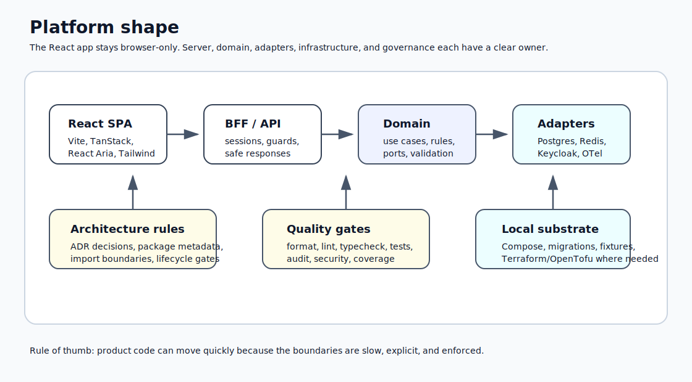
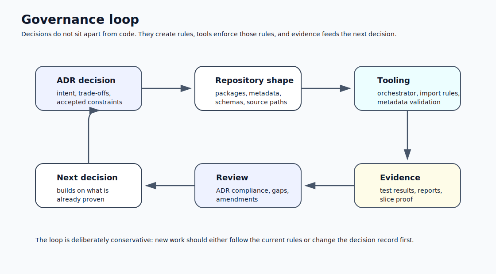
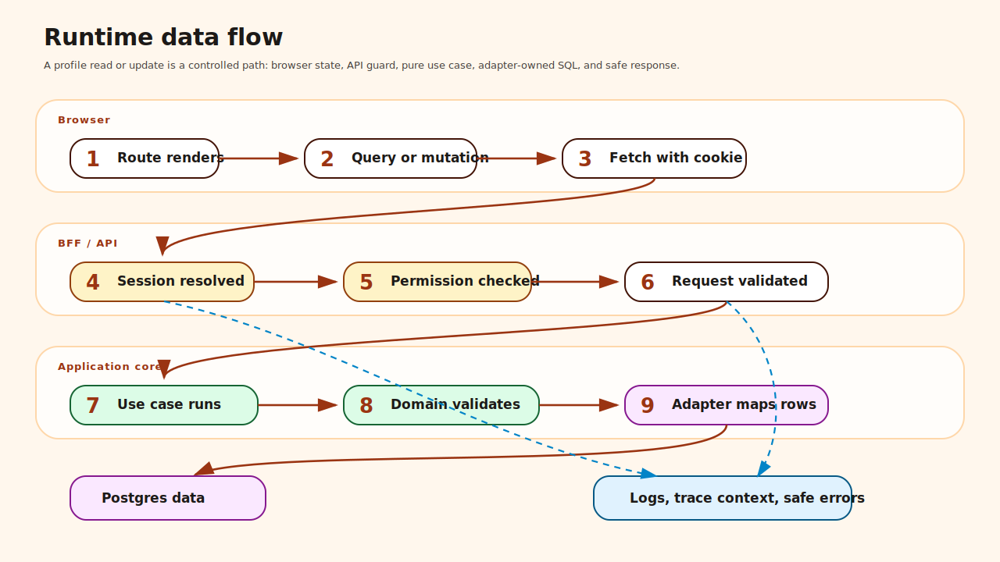

# Enterprise React Platform

A good application needs good foundations.

That sounds obvious until a team starts from the screen, wires a few forms to an API, adds a database call where it fits, and then tries to retrofit structure once the product has already hardened around shortcuts.

This repository takes the opposite path.

It starts with decisions. Those decisions are written down as Architecture Decision Records, tested through tooling, and then used as the ground that later decisions stand on. The result is not just a React app. It is a small enterprise platform built to show how frontend, backend, infrastructure, testing, and governance can grow together without turning into a pile of exceptions.



## What this project is

This is a governed React 19 monorepo built around a Vite SPA, a separate Node BFF/API runtime, domain packages, adapter packages, infrastructure definitions, and architecture tools that enforce the rules.

The first real vertical slice is complete: an authenticated organisation profile flow from React protected route to API guard, use case, domain validation, Postgres adapter, structured logs, trace context, and Playwright E2E coverage.

The repo is intentionally more than a demo UI. It is a practical example of application architecture designed to survive more than the first feature.

## How the application is designed

The current application behaviour is small but complete. A user opens the organisation profile page, the React feature asks the BFF for `/api/organisation/profile`, the API resolves session context, checks permissions, validates the request, calls a pure use case, and reaches Postgres only through a repository port and adapter.

That shape matters because every dependency has a reason to exist. The UI depends on feature hooks and contracts. The API depends on guards, runtime context, use cases, and safe error mapping. The use case depends on a port, not Postgres. The adapter owns SQL, row mapping, and connection pooling. Data never leaks backwards into the React app.


## Why it was built this way

The early decision was not "which component library should I use?" It was "what kinds of mistakes should the codebase make difficult?"

A few examples:

- The React app is browser-only. It does not own database access, migrations, sessions, or identity exchange.
- The API layer owns security enforcement. Protected routes improve UX, but API guards decide access.
- Domain and use-case code stays free of framework, HTTP, database, React, Keycloak, and observability SDK concerns.
- Adapters own external systems such as Postgres, Redis, Keycloak, OpenTelemetry, Sentry, object storage, email, and cloud services.
- Contracts use Zod so request and response shapes are explicit and testable.
- Package metadata, lifecycle rules, import boundaries, generated READMEs, and evidence bundles are validated by tools, not memory.

That makes the architecture slower to start, but faster to trust.

## How the project evolved

The commit history tells the story.

First came the governance baseline: ADRs, package metadata, lifecycle classes, JSON Schemas, generated package READMEs, inventory reports, lifecycle evidence, and an orchestrator to run the architecture checks in order.

Then came enforcement. Import-boundary validation was added so architectural rules were not just written in Markdown. Deep imports, test-support leakage, frontend-to-adapter shortcuts, and domain dependency violations became build-time failures.

Next the platform widened. Operations and delivery packages were added for API runtime, GraphQL runtime, workers, configuration, sessions, audit events, queues, storage, observability, auth, AWS, Cloudflare, Terraform workflow, CI, and local development services. These started as skeletons, but with real ownership, lifecycle metadata, and boundaries.

Then the quality baseline was tightened: Prettier, markdown linting, ESLint flat config, TypeScript strict checks, npm audit, OSV scanning, gitleaks, CodeQL, SonarQube, SBOM generation, and Docker Compose validation.

Only after that did the frontend stack become meaningful. React was paired with TanStack Router for typed routing, TanStack Query for server state, React Hook Form and Zod for forms, React Aria Components for accessible primitives, Tailwind for styling, Vitest/MSW for component tests, and Playwright for browser-level E2E tests.

Identity came next: users, organisations, memberships, roles, permissions, session actors, a Keycloak adapter boundary, and a BFF session model where raw tokens never belong in browser JavaScript.

Finally, the first vertical slice proved the architecture under pressure. A pragmatic implementation was then hardened into a cleaner hexagonal shape: repository port, Postgres adapter, dependency-injected use case, strict request contracts, safe error handling, runtime context propagation, and end-to-end tests.



## What the first slice proves

The organisation profile slice is deliberately small. The point was not feature volume. The point was proof.

It proves that the same path works from the browser down to persistence and back again.



That slice includes read, update, forbidden, unauthenticated, fixture-session, API, repository, frontend, compose, and browser-level tests.

## React choices

The React side is intentionally modern, but not novelty-driven.

TanStack Router was chosen because route params and search params should be typed, not guessed. TanStack Query owns server/cache state because async server data does not belong in a global UI store. Zustand is reserved for local cross-component UI state. React Hook Form and Zod keep forms close to the contract model. React Aria Components provide accessible behaviour without forcing a vendor design system.

The app uses open-code UI primitives. That means the platform owns its component source and styling rather than outsourcing long-term design decisions to a heavy component framework.

## Backend and boundary choices

The backend is a BFF/API runtime, not a hidden part of the React app.

That boundary matters. It keeps the browser from knowing about database clients, migrations, Keycloak SDKs, Redis sessions, token exchange, or server-only observability concerns. The browser asks for safe session state and calls approved API routes. The API derives runtime context, checks permissions, validates input, calls use cases, and maps infrastructure failures into safe responses.

The result is a frontend that stays clean and a backend that has a clear job.

## Local platform

The local environment uses Docker Compose for the services a real platform needs:

```text
PostgreSQL  Redis  ClickHouse  MinIO  Mailpit  OpenTelemetry Collector
```

Optional profiles add Keycloak, LocalStack, SonarQube, and Sentry. Terraform/OpenTofu is used for declarative infrastructure provisioning where infrastructure configuration matters, especially identity and later cloud environments.


## Current status

Done:

- 25 accepted ADRs
- 46 governed packages
- Architecture tooling and import-boundary enforcement
- Quality gate baseline
- Local service substrate
- React platform stack
- Identity and session model
- Playwright E2E substrate
- Authenticated organisation profile vertical slice
- Local Keycloak provisioning baseline
- Real OAuth 2.0 Authorization Code + PKCE login through platform-api BFF

Next:

- Live Keycloak browser E2E (requires `KEYCLOAK_CLIENT_SECRET` env var + running identity profile)
- Keycloak global logout (end-session endpoint)
- Second product slice

## Commands

```sh
npm ci
make all
```

Useful shorter commands:

```sh
make check             # format, lint, typecheck, audit, compose config, architecture
make ci                # CI-safe baseline
make compose-up-default
npm run test:e2e
npm run test:platform-api
```

## Repository map

```text
docs/                 ADRs, architecture notes, evidence, schemas, specs
apps/                 deployable application surfaces
packages/             domain, contract, feature, adapter, platform packages
tools/architecture/   governance tooling
infra/                Terraform/OpenTofu modules and environments
compose.yaml          local service substrate
Makefile              main developer workflow
```

## The point

This repo is what happens when React work is treated as application architecture, not just page construction.

It shows how trade-offs become decisions, how shortcuts are kept from becoming standards, and how design decisions are turned into enforceable code. Frontend state, routing, forms, accessibility, BFF boundaries, auth, domain modelling, infrastructure, CI, testing, observability, and architecture governance all have a place here.
